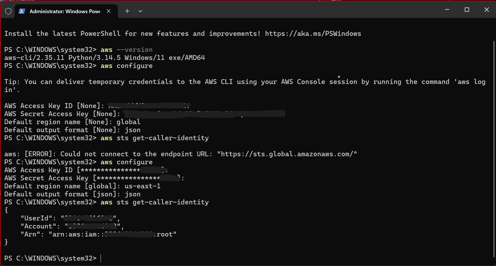
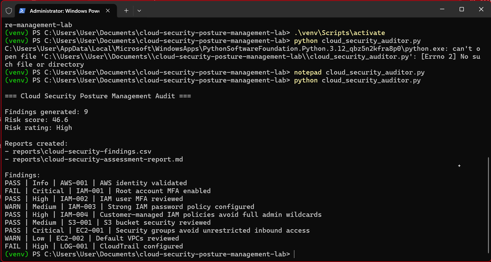
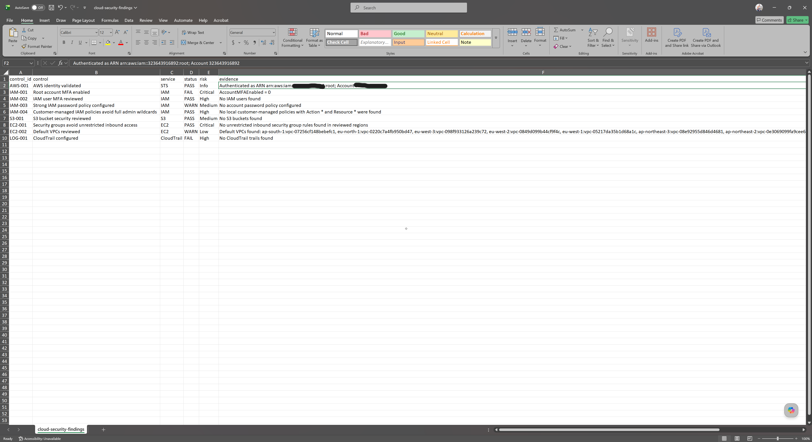
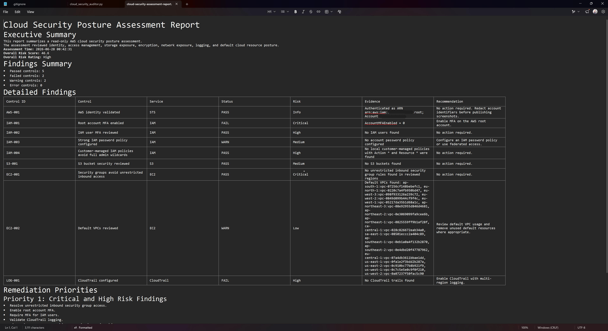

# Cloud Security Posture Management and Governance Lab

## Overview

This project demonstrates a cloud security posture management workflow for AWS.
The auditor performs read-only checks across IAM, S3, EC2 security groups, CloudTrail, and governance controls. It identifies cloud security risks, assigns risk ratings, generates CSV and Markdown reports, and provides remediation guidance.

## Tools Used

- AWS CLI
- Python
- boto3
- AWS IAM
- Amazon S3
- Amazon EC2 Security Groups
- AWS CloudTrail
- Terraform examples
- Markdown reporting
- CSV reporting

## Skills Demonstrated

- Cloud security posture management
- AWS security auditing
- IAM governance
- MFA validation
- S3 public access review
- S3 encryption review
- Security group exposure analysis
- CloudTrail logging validation
- Risk scoring
- Remediation planning
- Security reporting
- Cloud governance documentation

## Controls Reviewed

| Control | Service |

|---|---|

| AWS identity validation | STS |

| Root account MFA | IAM |

| IAM user MFA | IAM |

| IAM password policy | IAM |

| Overly permissive IAM policies | IAM |

| S3 public access block | S3 |

| S3 default encryption | S3 |

| Open security groups | EC2 |

| Default VPC review | EC2 |

| CloudTrail logging | CloudTrail |

## Project Workflow

1. Authenticate to AWS using AWS CLI.
2. Run the Python cloud security auditor.
3. Collect cloud configuration evidence.
4. Assign pass, fail, warning, or error status.
5. Calculate risk score and risk rating.
6. Generate CSV and Markdown reports.
7. Review remediation guidance.
8. Document findings and screenshots.

## Screenshots

### AWS CLI Identity Validation

### Cloud Security Audit Output
### Before Remdiation

### After Remdiation

.png)

### Findings CSV

### Before Remdiation

### After Remdiation

.png)

### Assessment Report

### Before Remdiation

### After Remdiation

.png)

## Security Takeaway

Cloud security requires continuous validation of identity, access, storage exposure, encryption, network access, logging, and governance controls. This project demonstrates how security engineering can automate cloud posture assessment and convert findings into risk-based remediation guidance.

